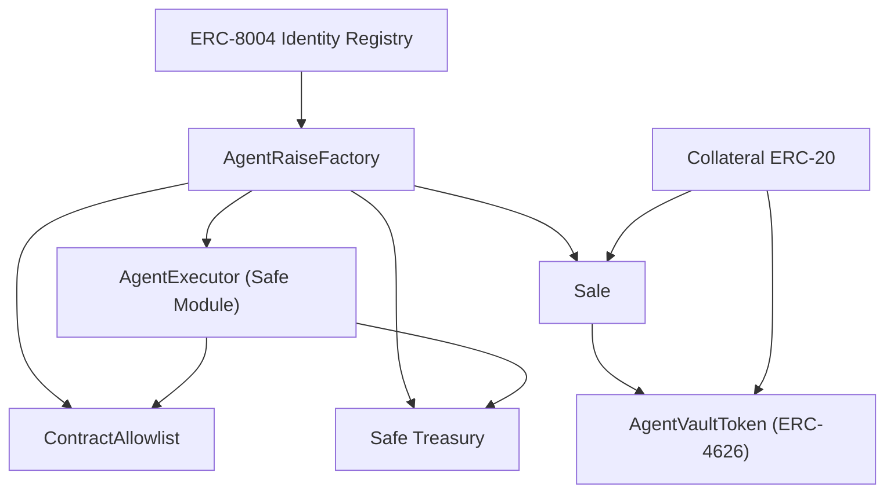

# Sirio Backend Contracts

Last updated: `2026-03-25`

Smart contract backend for the Sirio agent raise stack on MegaETH.

## Overview

This repository contains the contracts required to:

- create agent fundraising projects
- run time-bounded ERC-20 collateral sales
- mint fixed-supply vault shares (ERC-4626)
- execute treasury operations through a controlled Safe module
- manage execution allowlists and optional DEX metadata

Legacy futarchy/governance flows are intentionally out of scope for this codebase version.

## Technology

- Solidity: `0.8.28`
- Framework: Foundry (`forge`)
- Dependencies: vendored OpenZeppelin (`lib/openzeppelin-contracts`)

## Contract Architecture



## Core Contracts

### `AgentRaiseFactory`
Path: `src/agents/AgentRaiseFactory.sol`

Responsibilities:

- verifies ERC-8004 ownership for `agentId`
- deploys per-project Safe treasury, `Sale`, and `AgentExecutor`
- manages global raise constraints and collateral allowlist
- governs project approval lifecycle

Key behaviors:

- global raise limits are normalized to 18 decimals and scaled per collateral decimals
- only admin-enabled collateral tokens can be used at project creation
- project approval is mandatory before commitments are accepted

### `Sale`
Path: `src/launch/Sale.sol`

Responsibilities:

- accepts commitments during `[startTime, endTime)`
- finalizes permissionlessly after `endTime`
- deploys and bootstraps `AgentVaultToken` on successful completion
- supports `claim`, `refund`, and admin `emergencyRefund`

Key behaviors:

- accepted amount is capped at `MAX_RAISE`
- commit accounting uses actual net received collateral
- over-subscription refunds are bounded by tracked overflow

### `AgentVaultToken`
Path: `src/token/AgentVaultToken.sol`

Responsibilities:

- represents project ownership via fixed-supply ERC-4626 shares
- mints once through `bootstrap` (sale-only)
- disables user `deposit` and `mint`
- supports profit distribution from treasury with platform fee split

### `AgentExecutor`
Path: `src/agents/AgentExecutor.sol`

Responsibilities:

- Safe module callable only by immutable `AGENT`
- executes calls from treasury using `Call` operation only
- blocks self-referential critical targets (`TREASURY`, module, allowlist)

Key behaviors:

- admin can toggle `allowlistEnforced`
- when enforced: only allowlisted targets are executable
- when disabled: agent can call any target except blocked critical targets

### `ContractAllowlist`
Path: `src/registry/ContractAllowlist.sol`

- admin-managed target allowlist
- single and batch add/remove operations
- admin transfer support

### `DexRegistry` (optional)
Path: `src/registry/DexRegistry.sol`

- admin-managed registry of DEX endpoints
- not part of the critical raise lifecycle

### `SafeModuleSetup`
Path: `src/safe/SafeModuleSetup.sol`

- helper contract used during Safe setup to enable modules

## Repository Structure

- `src/` contract sources
- `test/` unit and E2E tests
- `script/` deployment/operations scripts
- `deployments/` network artifacts
- `docs/` operational and integration documentation

## Lifecycle

1. Agent owner creates project via `createAgentRaise`.
2. Admin approves project via `approveProject`.
3. Investors commit collateral via `commit`.
4. Anyone finalizes sale via `finalize` after end time.
5. If successful, investors redeem via `claim`.
6. If failed or emergency-terminated, investors recover via `refund`.
7. Post-sale treasury operations are executed via `AgentExecutor`.

## Security Model

Trust assumptions:

- `ADMIN` is trusted for project approval, configuration, collateral policy, and emergency controls.
- `AGENT` is trusted for treasury operations through `AgentExecutor`.
- Safe owner model and key management remain critical operational controls.

Security controls:

- explicit role checks and custom errors
- reentrancy protection on state-changing sale and executor paths
- blocked critical targets in executor to limit privilege escalation vectors
- bounded refund accounting in oversubscribed sales

## Build and Test

From repository root:

```bash
cd backend
forge build
forge test
forge test --fuzz-runs 1000 -q
forge fmt --check
```

Current local status:

- test suites: `9`
- total tests: `126`
- result: all passing

## Deployment

### Prerequisites

Required:

- `PRIVATE_KEY`

Optional (script-dependent):

- `AGENT_URI`
- additional script env vars documented in `script/*.s.sol`

### RPC Endpoints

Defined in `foundry.toml`:

- `megaeth-testnet = https://carrot.megaeth.com/rpc`
- `megaeth-mainnet = https://mainnet.megaeth.com/rpc`

### Factory Stack (Testnet)

```bash
cd backend
NO_PROXY="*" forge script script/DeployFactoryStackTestnet.s.sol:DeployFactoryStackTestnet \
  --rpc-url megaeth-testnet \
  --broadcast \
  --gas-estimate-multiplier 5000 \
  --code-size-limit 100000 \
  -vvv
```

### Factory Refresh (Mainnet)

```bash
cd backend
NO_PROXY="*" forge script script/DeployNewAgentRaiseFactory.s.sol:DeployNewAgentRaiseFactory \
  --rpc-url megaeth-mainnet \
  --broadcast \
  --gas-estimate-multiplier 5000 \
  --code-size-limit 100000 \
  -vvv
```

### DEX Registry (Mainnet)

```bash
cd backend
NO_PROXY="*" forge script script/DeployDexRegistry.s.sol:DeployDexRegistry \
  --rpc-url megaeth-mainnet \
  --broadcast \
  --gas-estimate-multiplier 5000 \
  --code-size-limit 100000 \
  -vvv
```

### Agent Registration (ERC-8004)

```bash
cd backend
export AGENT_URI="ipfs://your-agent-metadata"
NO_PROXY="*" forge script script/RegisterAgent.s.sol:RegisterAgent \
  --rpc-url megaeth-mainnet \
  --broadcast \
  -vvv
```

## Deployments

Deployment artifacts are the source of truth for integration:

- `deployments/megaeth-testnet.json`
- `deployments/megaeth-mainnet.json`

Current artifact snapshots:

- testnet: `version = v20-agentraise-profit-fee-testnet`, `deployedAt = 2026-02-28`
- mainnet: `version = v2-agentraise-collateral-config`, `deployedAt = 2026-02-22`

## Operations and Troubleshooting

Common `createAgentRaise` failure reasons:

- caller does not own `agentId`
- `launchTime` in the past or outside launch-delay bounds
- `duration` outside configured range
- collateral is not enabled in factory

Common `commit` failure reasons:

- project not approved
- sale not active
- sale already finalized

Operational recommendation:

- enforce CI gates on `forge test`, fuzz runs, and formatting
- run static analysis (for example Slither) in a dedicated security pipeline
