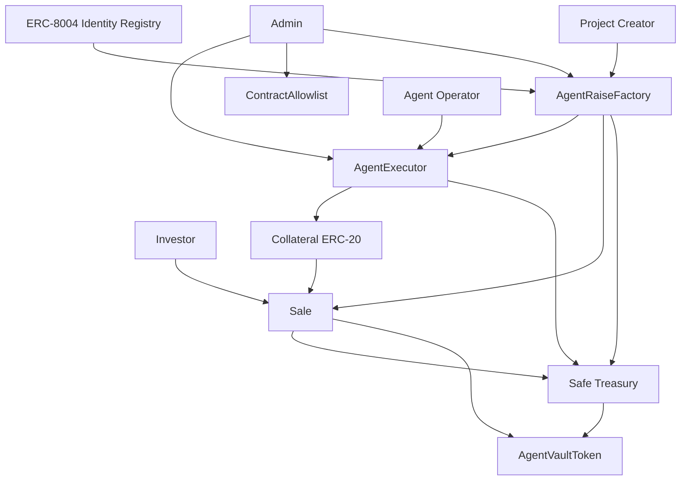

# Backed Backend Contracts

Smart contracts for the agent raise stack: identity-gated project creation, time-bounded fundraising, treasury-operated fund execution, fixed-supply share issuance, and policy-constrained treasury execution on MegaETH.

This repository is the onchain backend for the current raise flow. It does **not** try to be a full governance system or a generic treasury framework. Its scope is narrower and more explicit:

- create a project from an agent identity
- raise ERC-20 collateral during a scheduled sale window
- move accepted capital into the project treasury for agent operation
- mint fixed-supply fund shares to investors
- enforce a fund term lockup before settlement and redemption open
- support policy-constrained treasury execution through an `AgentExecutor` Safe module

## What This System Does

At a high level, one factory call creates a full project envelope:

1. a Safe treasury
2. a `Sale` contract
3. an `AgentExecutor` Safe module

After that:

1. the platform admin explicitly approves the raise
2. investors commit collateral during the active window
3. anyone can finalize once the sale ends
4. success bootstraps an `AgentVaultToken` and moves accepted capital to the treasury
5. failure enables refunds
6. post-raise treasury actions can be routed through the executor under an allowlist and selector policy

The design intentionally separates:

- project origination
- fundraising
- investor settlement
- treasury operation

That separation is one of the main structural properties of the stack.

## Stack

- Solidity: `0.8.28`
- Framework: Foundry
- Primary dependency: OpenZeppelin contracts
- Deployment target: MegaETH
- Source directory: `src/`

## Architecture



## Core Contracts

### `AgentRaiseFactory`
Path: `src/agents/AgentRaiseFactory.sol`

This is the origination and governance entry point.

Responsibilities:

- verifies that the caller owns the `agentId`
- validates creation parameters
- deploys the Safe treasury, `Sale`, and `AgentExecutor`
- wires the Safe module setup
- stores project metadata and raise configuration
- gates fundraising through explicit admin approval

Important behaviors:

- raise bounds are stored in normalized 18 decimals and scaled to the collateral token decimals
- unsupported collateral is rejected at creation time
- project approval gates `Sale.commit(...)`, but revoking approval does not unwind already committed capital
- `updateProjectOperationalStatus(...)` is callable by the stored project agent or admin, not by a fresh `ownerOf(agentId)` lookup

### `Sale`
Path: `src/launch/Sale.sol`

This is the fundraising state machine.

Responsibilities:

- accepts collateral commitments during the active sale window
- finalizes permissionlessly after `endTime`
- resolves success vs failure
- deploys and bootstraps `AgentVaultToken` on success
- transfers accepted capital into the treasury on success
- handles `claim()`, `refund()`, and `emergencyRefund()`

Important behaviors:

- `commit(...)` requires project approval and exact collateral transfer behavior
- `acceptedAmount` is capped at `MAX_RAISE`
- oversubscription is resolved during `claim()`, not during `commit()`
- `claim()` transfers fund shares, not underlying collateral
- `LOCKUP_MINUTES` starts at sale end and defines when settlement and redemption may open
- the final claimer receives residual accounting to avoid trapped rounding dust

### `AgentVaultToken`
Path: `src/token/AgentVaultToken.sol`

This is the post-raise ownership token.

Responsibilities:

- represents project ownership via fixed-supply fund shares
- is bootstrapped once by the sale
- finalizes settlement once the treasury has unwound back into collateral
- redeems shares into collateral after settlement opens

Important behaviors:

- initial share pricing is bootstrapped at `1:1` against the underlying asset
- fixed supply is minted only once during bootstrap
- accepted capital stays in the treasury during the fund term, not inside the share token
- `LOCKUP_END_TIME` marks the earliest time settlement can be finalized and redemptions can open
- platform fees are applied on positive profit during settlement, not during initial bootstrap

### `AgentExecutor`
Path: `src/agents/AgentExecutor.sol`

This is the policy-constrained treasury execution module.

Responsibilities:

- acts as a Safe module
- allows only the immutable `AGENT` address to trigger execution through the module path
- enforces policy on targets, selectors, and approval recipients for module-originated calls

Important behaviors:

- hard-blocks `TREASURY`, the executor itself, and the allowlist contract as targets
- forwards only `Call`, never `DelegateCall`
- when `allowlistEnforced == true`, both target and selector must be approved
- approval-like selectors also require the spender or operator to be allowlisted
- when `allowlistEnforced == false`, all those checks are bypassed except the three hard-blocked targets
- the contract constrains the module path only; treasury owner powers still depend on the Safe configuration used at deployment

### `ContractAllowlist`
Path: `src/registry/ContractAllowlist.sol`

This is a shared target registry used by executors when allowlist enforcement is enabled.

Responsibilities:

- add and remove allowed targets
- batch add and batch remove targets
- transfer allowlist admin

Important note:

- this contract stores target allowlisting only
- selector policy is stored per `AgentExecutor`

### `SafeModuleSetup`
Path: `src/safe/SafeModuleSetup.sol`

This is a helper used during Safe initialization to enable modules.

## Roles

### Project Creator

- must own the supplied `agentId`
- calls `createAgentRaise(...)`
- becomes the stored `project.agent`
- may update project operational status

### Agent Operator

- is provided as `agentAddress` during project creation
- is the only caller allowed to use `AgentExecutor.execute(...)`

### Factory Admin

- approves or revokes projects
- changes global config
- changes allowed collateral
- updates project metadata
- is the `SUPER_ADMIN()` seen by `Sale`

### Executor Admin

- toggles allowlist enforcement
- configures allowed selectors per target

### Allowlist Admin

- manages globally allowed targets in `ContractAllowlist`

### Investor

- commits collateral
- can finalize after sale end
- claims shares on success
- refunds on failure

## End-to-End Lifecycle

### 1. Identity-gated creation

Project creation begins at:

```solidity
createAgentRaise(
    agentId,
    name,
    description,
    categories,
    agentAddress,
    collateral,
    duration,
    launchTime,
    lockupMinutes,
    tokenName,
    tokenSymbol
)
```

The factory checks:

- `IDENTITY_REGISTRY.ownerOf(agentId) == msg.sender`
- non-empty `name`
- non-zero `agentAddress`
- supported collateral
- `duration > 0`
- `launchTime >= block.timestamp`
- valid scaled min/max raise after applying collateral decimals

### 2. Atomic deployment

On success, the factory:

1. creates a Safe treasury
2. deploys `Sale`
3. deploys `AgentExecutor`
4. enables the executor as a Safe module
5. removes itself from the Safe module list
6. stores the project

### 3. Approval-gated fundraising

The sale is not immediately investable.

Investors can only commit after:

- the project has been approved
- `startTime` has arrived
- `endTime` has not passed
- the sale is not finalized

### 4. Finalization

After `endTime`, anyone can call `finalize()`.

Possible outcomes:

- no commitments: failed
- commitments below `MIN_RAISE`: failed
- commitments at or above `MIN_RAISE`: success

On success:

- accepted capital is capped at `MAX_RAISE`
- `AgentVaultToken` is deployed
- accepted collateral is transferred into the treasury
- fixed shares are minted to the sale contract
- the share token records `LOCKUP_END_TIME = endTime + lockupMinutes`

### 5. Investor settlement

After finalization:

- success path: investors call `claim()`
- failure path: investors call `refund()`

After `claim()` on a successful raise:

- investors hold ERC-20 fund shares in their wallet
- `redeem()` and `withdraw()` stay blocked until `LOCKUP_END_TIME`
- once the lockup expires and the treasury finalizes settlement, investors can exit against the settled collateral pool

There is also an admin emergency path:

- `emergencyRefund()`

### 6. Post-raise treasury operation

After successful finalization:

- admin configures target and selector policy
- operator can call `AgentExecutor.execute(...)`
- executor-enforced policy applies to calls routed through the module path
- direct treasury owner actions remain governed by the deployed Safe configuration

## Security Model

This system is not trustless. It is a constrained-authority design.

### Main trust assumptions

- the identity registry is trusted as the source of creation authority
- the admin is trusted for raise admission, emergency controls, and treasury policy configuration
- the operator is trusted to use approved treasury actions correctly
- the Safe deployment, owner configuration, and module wiring must be correct

### Main control points

- strict caller checks on privileged functions
- reentrancy protection on `Sale` and `AgentExecutor` state-changing entry points
- hard-blocked treasury self-targeting inside the module path
- exact-transfer checks for collateral-sensitive flows
- bounded oversubscription refund accounting

### Main known risk areas

- `Sale` accounting and settlement logic
- executor break-glass mode via `setAllowlistEnforced(false)`
- gaps between Safe owner powers and module-level policy assumptions
- privileged operations with no in-code timelock
- assumptions about collateral token behavior

## Repository Layout

- `src/` protocol contracts
- `test/` unit and end-to-end tests
- `script/` deployment and operational scripts
- `docs/` supporting operational documentation
- `x-ray/` generated audit-readiness and architecture outputs

## Key Scripts

Current scripts:

- `script/DeployFactoryStackTestnet.s.sol`
- `script/DeployNewAgentRaiseFactory.s.sol`
- `script/DeployTestnetStackAndRaise.s.sol`
- `script/RegisterAgent.s.sol`

## Build

From the repository root:

```bash
cd backend
forge build
```

## Test

Typical commands:

```bash
cd backend
forge test
forge test --fuzz-runs 1000 -q
forge fmt --check
```

Based on the current test suite, the repository contains:

- `15` test files
- `137` test functions

What is currently missing from the codebase quality posture:

- stateless fuzz coverage
- stateful invariant testing
- formal verification artifacts

## Deployment

For detailed deployment instructions, see:

- `docs/DEPLOY.md`
- `docs/CREATE_AGENT.md`
- `docs/AGENT_CREATION_GUIDE.md`

### Network endpoints

Defined in `foundry.toml`:

- `megaeth-testnet = https://carrot.megaeth.com/rpc`
- `megaeth-mainnet = https://mainnet.megaeth.com/rpc`

### Common deployment commands

Deploy testnet factory stack:

```bash
cd backend
NO_PROXY="*" forge script script/DeployFactoryStackTestnet.s.sol:DeployFactoryStackTestnet \
  --rpc-url megaeth-testnet \
  --broadcast \
  --gas-estimate-multiplier 5000 \
  --code-size-limit 100000 \
  -vvv
```

Redeploy mainnet raise stack:

```bash
cd backend
NO_PROXY="*" forge script script/DeployNewAgentRaiseFactory.s.sol:DeployNewAgentRaiseFactory \
  --rpc-url megaeth-mainnet \
  --broadcast \
  --gas-estimate-multiplier 5000 \
  --code-size-limit 100000 \
  -vvv
```

Register an agent identity:

```bash
cd backend
export AGENT_URI="ipfs://your-agent-metadata"
NO_PROXY="*" forge script script/RegisterAgent.s.sol:RegisterAgent \
  --rpc-url megaeth-mainnet \
  --broadcast \
  -vvv
```

## Integration Surfaces

Most integrations only need a small subset of methods.

### Factory reads

- `projectCount()`
- `getProject(projectId)`
- `getProjectRaiseSnapshot(projectId)`
- `getProjectCommitment(projectId, user)`
- `globalConfig()`
- `minRaiseForCollateral(collateral)`
- `maxRaiseForCollateral(collateral)`

### Sale reads

- `getStatus()`
- `isActive()`
- `timeRemaining()`
- `getClaimable(user)`
- `getRefundable(user)`
- `token()`

### Treasury policy reads

- `allowlistEnforced()`
- `isSelectorAllowed(target, selector)`
- `ContractAllowlist.isAllowed(target)`

## Operational Notes

### Common creation failures

- caller is not the current owner of `agentId`
- unsupported collateral
- zero `duration`
- zero or past `launchTime`
- invalid scaled min/max config after decimal conversion

### Common commitment failures

- project not approved
- sale not active
- sale already finalized
- zero amount
- collateral transfer did not match the requested amount

### Common treasury execution failures

- caller is not the configured `AGENT`
- target is not allowed
- selector is not allowed
- approval recipient is not allowed
- Safe execution failed downstream

## Audit Readiness Snapshot

The latest x-ray output in `x-ray/` classifies the codebase as:

**FRAGILE**

Why:

- compact codebase, but concentrated complexity in `AgentRaiseFactory`, `Sale`, and `AgentExecutor`
- single-developer git history
- no visible merge-based review flow
- no fuzz, invariant, or formal verification artifacts
- privileged operational powers execute immediately

Priority review areas:

1. `src/launch/Sale.sol`
2. `src/agents/AgentExecutor.sol`
3. `src/token/AgentVaultToken.sol`
4. `src/agents/AgentRaiseFactory.sol`

## Recommended Next Hardening Steps

- add invariant tests for raise lifecycle closure
- add fuzz tests for oversubscription, rounding, and profit distribution
- harden or narrow the executor break-glass path
- evaluate timelock or multisig control for admin-operated surfaces
- document collateral assumptions explicitly for integrators

## Additional References

- `docs/DEPLOY.md`
- `docs/DEBUG_AGENT_RAISE.md`
- `docs/CREATE_AGENT.md`
- `docs/AGENT_CREATION_GUIDE.md`
- `docs/SMART_CONTRACT_FLOW.typ`
- `x-ray/x-ray.md`
- `x-ray/entry-points.md`
