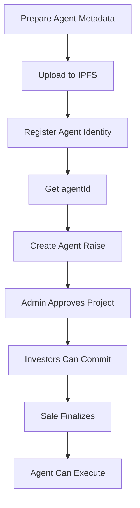

# Complete Guide: Creating an Agent Raise

## Table of Contents

1. [Overview](#overview)
2. [Prerequisites](#prerequisites)
3. [Step-by-Step Process](#step-by-step-process)
4. [Agent Identity Registration](#agent-identity-registration)
5. [Creating Agent Raise](#creating-agent-raise)
6. [Project Approval](#project-approval)
7. [Complete Examples](#complete-examples)
8. [Troubleshooting](#troubleshooting)
9. [Best Practices](#best-practices)
10. [API Reference](#api-reference)

---

## Overview

The Sirio platform allows agents to create fundraising campaigns (raises) through a two-step process:

1. **Register Agent Identity**: Create an ERC-8004 identity NFT that represents your agent
2. **Create Agent Raise**: Deploy a fundraising campaign with a Gnosis Safe treasury, Sale contract, and AgentExecutor module

### What Gets Created

When you create an agent raise, the system automatically deploys:

- **Gnosis Safe Treasury**: Multi-sig wallet owned by the agent owner
- **Sale Contract**: Token Generation Event (TGE) for fundraising
- **AgentVaultToken**: ERC-4626 vault token representing fractional ownership
- **AgentExecutor**: Safe module that allows the agent wallet to execute transactions

---

## Prerequisites

### 1. Wallet Setup

- MetaMask or compatible wallet installed
- Connected to MegaETH Testnet (Chain ID: 6343)
- Sufficient ETH for gas fees
- Wallet address that will own the agent identity

### 2. Agent Metadata

Prepare an IPFS URI pointing to your agent registration JSON file. The file should follow ERC-8004 format:

```json
{
  "name": "Your Agent Name",
  "description": "Agent description",
  "image": "ipfs://...",
  "attributes": [
    {
      "trait_type": "Category",
      "value": "DeFi"
    }
  ]
}
```

### 3. Network Configuration

**MegaETH Testnet:**
- Chain ID: `6343`
- RPC URL: `https://carrot.megaeth.com/rpc`
- Explorer: `https://megaeth.blockscout.com`

### 4. Contract Addresses

**Testnet Deployments:**
```
Identity Registry:     0x8004A818BFB912233c491871b3d84c89A494BD9e
AgentRaiseFactory:     0xF37D82e3272C3bA2C8111EbADff88a050B271e1b
USDM Collateral:       0x9f5A17BD53310D012544966b8e3cF7863fc8F05f
```

---

## Step-by-Step Process

### Flow Diagram



---

## Agent Identity Registration

### Step 1: Prepare Agent URI

Upload your agent metadata JSON to IPFS and get the URI:

```bash
# Example using IPFS
ipfs add agent-metadata.json
# Returns: QmXxxx...
# URI: ipfs://QmXxxx...
```

### Step 2: Register Identity

Call the Identity Registry contract to register your agent:

**Contract:** `0x8004A818BFB912233c491871b3d84c89A494BD9e`

**Function:**
```solidity
function register(string calldata agentURI) external returns (uint256 agentId)
```

**Parameters:**
- `agentURI`: IPFS URI of your agent metadata (e.g., `"ipfs://QmXxxx..."`)

**Returns:**
- `agentId`: ERC-721 token ID representing your agent identity

### Step 3: Verify Ownership

After registration, verify you own the agentId:

```solidity
function ownerOf(uint256 agentId) external view returns (address owner)
```

---

## Creating Agent Raise

### Function Signature

```solidity
function createAgentRaise(
    uint256 agentId,           // ERC-8004 identity NFT token ID
    string calldata name,      // Project name (required, non-empty)
    string calldata description, // Project description
    string calldata categories,  // Comma-separated categories
    address agentAddress,      // Agent wallet (for AgentExecutor)
    address collateral,        // ERC-20 collateral token (must be whitelisted)
    uint256 duration,          // Sale duration in seconds
    uint256 launchTime,        // Unix timestamp when sale starts
    string calldata tokenName, // ERC-20 token name
    string calldata tokenSymbol // ERC-20 token symbol
) external returns (uint256 projectId)
```

### Parameter Details

| Parameter | Type | Description | Constraints |
|-----------|------|-------------|-------------|
| `agentId` | `uint256` | Your registered agent identity ID | Must own this NFT |
| `name` | `string` | Project name | Non-empty |
| `description` | `string` | Project description | Can be empty |
| `categories` | `string` | Comma-separated tags | e.g., `"defi,ai,infrastructure"` |
| `agentAddress` | `address` | Agent wallet address | Non-zero address |
| `collateral` | `address` | Collateral token address | Must be whitelisted |
| `duration` | `uint256` | Sale duration (seconds) | `minDuration <= duration <= maxDuration` |
| `launchTime` | `uint256` | Sale start timestamp | Must be future, delay within limits |
| `tokenName` | `string` | Vault token name | e.g., `"Agent Vault Token"` |
| `tokenSymbol` | `string` | Vault token symbol | e.g., `"AVT"` |

### Global Configuration Defaults

The factory has default limits (can be changed by admin):

```solidity
struct GlobalConfig {
    uint256 minRaise;              // Default: 2.5e21 (2,500 USDM)
    uint256 maxRaise;              // Default: 1e22 (10,000 USDM)
    uint16 platformFeeBps;        // Default: 500 (5%)
    address platformFeeRecipient;  // Admin address
    uint256 minDuration;           // Default: 1 hour (3600 seconds)
    uint256 maxDuration;           // Default: 30 days (2,592,000 seconds)
    uint256 minLaunchDelay;        // Default: 0
    uint256 maxLaunchDelay;        // Default: 365 days (31,536,000 seconds)
}
```

### Validation Rules

The contract validates:

1. **Ownership**: `IDENTITY_REGISTRY.ownerOf(agentId) == msg.sender`
2. **Name**: `bytes(name).length > 0`
3. **Duration**: `duration > 0` and within `[minDuration, maxDuration]`
4. **Launch Time**: 
   - `launchTime >= block.timestamp` (future)
   - `launchDelay = launchTime - block.timestamp`
   - `minLaunchDelay <= launchDelay <= maxLaunchDelay`
5. **Agent Address**: `agentAddress != address(0)`
6. **Collateral**: `allowedCollateral[collateral] == true`

---

## Project Approval

After creating an agent raise, the project must be approved by the admin before investors can commit funds.

### Admin Approval

```solidity
function approveProject(uint256 projectId) external onlyAdmin
```

**Note:** Only the factory admin can approve projects. Contact the platform admin for approval.

### Check Approval Status

```solidity
function isProjectApproved(uint256 id) external view returns (bool)
```

---

## Complete Examples

### Example 1: Foundry Script (Solidity)

```solidity
// SPDX-License-Identifier: MIT
pragma solidity 0.8.28;

import {Script, console} from "forge-std/Script.sol";
import {AgentRaiseFactory} from "../src/agents/AgentRaiseFactory.sol";

interface IIdentityRegistry {
    function register(string calldata agentURI) external returns (uint256 agentId);
}

contract CreateAgentRaise is Script {
    address constant IDENTITY_REGISTRY = 0x8004A818BFB912233c491871b3d84c89A494BD9e;
    address constant FACTORY = 0xF37D82e3272C3bA2C8111EbADff88a050B271e1b;
    address constant COLLATERAL = 0x9f5A17BD53310D012544966b8e3cF7863fc8F05f; // USDM

    function run() external {
        uint256 deployerKey = vm.envUint("PRIVATE_KEY");
        address deployer = vm.addr(deployerKey);

        vm.startBroadcast(deployerKey);

        // Step 1: Register Agent Identity
        string memory agentURI = "ipfs://QmXxxx..."; // Your IPFS URI
        uint256 agentId = IIdentityRegistry(IDENTITY_REGISTRY).register(agentURI);
        console.log("Registered Agent ID:", agentId);

        // Step 2: Create Agent Raise
        AgentRaiseFactory factory = AgentRaiseFactory(FACTORY);
        
        uint256 duration = 7 days; // Sale duration
        uint256 launchTime = block.timestamp + 1 days; // Start in 1 day

        uint256 projectId = factory.createAgentRaise(
            agentId,
            "My Agent Project",
            "A revolutionary DeFi agent",
            "defi,ai,automation",
            deployer, // agentAddress
            COLLATERAL,
            duration,
            launchTime,
            "Agent Vault Token",
            "AVT"
        );

        console.log("Created Project ID:", projectId);

        vm.stopBroadcast();
    }
}
```

**Run:**
```bash
forge script script/CreateAgentRaise.s.sol:CreateAgentRaise \
  --rpc-url https://carrot.megaeth.com/rpc \
  --broadcast \
  --verify
```

### Example 2: TypeScript/Viem (Frontend)

```typescript
import { createPublicClient, createWalletClient, http, parseEther } from 'viem';
import { privateKeyToAccount } from 'viem/accounts';
import { megaethTestnet } from 'viem/chains';

// Contract addresses
const IDENTITY_REGISTRY = '0x8004A818BFB912233c491871b3d84c89A494BD9e';
const FACTORY = '0xF37D82e3272C3bA2C8111EbADff88a050B271e1b';
const COLLATERAL = '0x9f5A17BD53310D012544966b8e3cF7863fc8F05f'; // USDM

// ABI snippets
const IdentityRegistryABI = [
  {
    name: 'register',
    type: 'function',
    stateMutability: 'nonpayable',
    inputs: [{ name: 'agentURI', type: 'string' }],
    outputs: [{ name: 'agentId', type: 'uint256' }]
  },
  {
    name: 'ownerOf',
    type: 'function',
    stateMutability: 'view',
    inputs: [{ name: 'tokenId', type: 'uint256' }],
    outputs: [{ name: 'owner', type: 'address' }]
  }
] as const;

const AgentRaiseFactoryABI = [
  {
    name: 'createAgentRaise',
    type: 'function',
    stateMutability: 'nonpayable',
    inputs: [
      { name: 'agentId', type: 'uint256' },
      { name: 'name', type: 'string' },
      { name: 'description', type: 'string' },
      { name: 'categories', type: 'string' },
      { name: 'agentAddress', type: 'address' },
      { name: 'collateral', type: 'address' },
      { name: 'duration', type: 'uint256' },
      { name: 'launchTime', type: 'uint256' },
      { name: 'tokenName', type: 'string' },
      { name: 'tokenSymbol', type: 'string' }
    ],
    outputs: [{ name: 'projectId', type: 'uint256' }]
  },
  {
    name: 'globalConfig',
    type: 'function',
    stateMutability: 'view',
    inputs: [],
    outputs: [
      { name: 'minRaise', type: 'uint256' },
      { name: 'maxRaise', type: 'uint256' },
      { name: 'platformFeeBps', type: 'uint16' },
      { name: 'platformFeeRecipient', type: 'address' },
      { name: 'minDuration', type: 'uint256' },
      { name: 'maxDuration', type: 'uint256' },
      { name: 'minLaunchDelay', type: 'uint256' },
      { name: 'maxLaunchDelay', type: 'uint256' }
    ]
  },
  {
    name: 'allowedCollateral',
    type: 'function',
    stateMutability: 'view',
    inputs: [{ name: '', type: 'address' }],
    outputs: [{ name: '', type: 'bool' }]
  }
] as const;

async function createAgentRaise(
  agentURI: string,
  projectName: string,
  projectDescription: string,
  categories: string,
  agentAddress: `0x${string}`,
  duration: number, // in seconds
  launchDelay: number, // seconds until launch
  tokenName: string,
  tokenSymbol: string
) {
  // Setup clients
  const account = privateKeyToAccount(`0x${process.env.PRIVATE_KEY}` as `0x${string}`);
  const publicClient = createPublicClient({
    chain: megaethTestnet,
    transport: http('https://carrot.megaeth.com/rpc')
  });
  const walletClient = createWalletClient({
    account,
    chain: megaethTestnet,
    transport: http('https://carrot.megaeth.com/rpc')
  });

  // Step 1: Register Agent Identity
  console.log('Registering agent identity...');
  const registerHash = await walletClient.writeContract({
    address: IDENTITY_REGISTRY,
    abi: IdentityRegistryABI,
    functionName: 'register',
    args: [agentURI]
  });

  const receipt = await publicClient.waitForTransactionReceipt({ hash: registerHash });
  
  // Extract agentId from event (or call ownerOf with a high ID and work backwards)
  // For simplicity, assume we know the agentId or parse it from events
  const agentId = BigInt(18); // Replace with actual agentId from registration

  // Verify ownership
  const owner = await publicClient.readContract({
    address: IDENTITY_REGISTRY,
    abi: IdentityRegistryABI,
    functionName: 'ownerOf',
    args: [agentId]
  });

  if (owner.toLowerCase() !== account.address.toLowerCase()) {
    throw new Error('Not the owner of this agentId');
  }

  // Step 2: Check global config
  const config = await publicClient.readContract({
    address: FACTORY,
    abi: AgentRaiseFactoryABI,
    functionName: 'globalConfig'
  });

  // Validate duration
  if (duration < Number(config.minDuration) || duration > Number(config.maxDuration)) {
    throw new Error(
      `Duration must be between ${config.minDuration} and ${config.maxDuration} seconds`
    );
  }

  // Validate launch delay
  if (launchDelay < Number(config.minLaunchDelay) || launchDelay > Number(config.maxLaunchDelay)) {
    throw new Error(
      `Launch delay must be between ${config.minLaunchDelay} and ${config.maxLaunchDelay} seconds`
    );
  }

  // Check collateral is whitelisted
  const isCollateralAllowed = await publicClient.readContract({
    address: FACTORY,
    abi: AgentRaiseFactoryABI,
    functionName: 'allowedCollateral',
    args: [COLLATERAL]
  });

  if (!isCollateralAllowed) {
    throw new Error('Collateral token is not whitelisted');
  }

  // Calculate launch time
  const currentTime = Math.floor(Date.now() / 1000);
  const launchTime = currentTime + launchDelay;

  // Step 3: Simulate transaction
  console.log('Simulating transaction...');
  try {
    const { result } = await publicClient.simulateContract({
      account: account.address,
      address: FACTORY,
      abi: AgentRaiseFactoryABI,
      functionName: 'createAgentRaise',
      args: [
        agentId,
        projectName,
        projectDescription,
        categories,
        agentAddress,
        COLLATERAL,
        BigInt(duration),
        BigInt(launchTime),
        tokenName,
        tokenSymbol
      ]
    });

    console.log('Simulation successful. Project ID:', result);
  } catch (error: any) {
    console.error('Simulation failed:', error);
    throw error;
  }

  // Step 4: Execute transaction
  console.log('Creating agent raise...');
  const hash = await walletClient.writeContract({
    address: FACTORY,
    abi: AgentRaiseFactoryABI,
    functionName: 'createAgentRaise',
    args: [
      agentId,
      projectName,
      projectDescription,
      categories,
      agentAddress,
      COLLATERAL,
      BigInt(duration),
      BigInt(launchTime),
      tokenName,
      tokenSymbol
    ]
  });

  const createReceipt = await publicClient.waitForTransactionReceipt({ hash });
  console.log('Transaction confirmed:', createReceipt.transactionHash);

  // Extract projectId from events
  // The projectId is the length of the projects array - 1
  // Or parse from AgentRaiseCreated event

  return hash;
}

// Usage
createAgentRaise(
  'ipfs://QmXxxx...',
  'My Agent Project',
  'A revolutionary DeFi agent',
  'defi,ai,automation',
  '0xb23a9d08A409d669D26BfBc78cb0342E131bBE2a',
  7 * 24 * 60 * 60, // 7 days
  24 * 60 * 60, // 1 day delay
  'Agent Vault Token',
  'AVT'
).catch(console.error);
```

### Example 3: Using Wallet Connect (MetaMask)

```typescript
import { useAccount, useWalletClient, usePublicClient } from 'wagmi';
import { parseEther } from 'viem';

function useCreateAgentRaise() {
  const { address } = useAccount();
  const { data: walletClient } = useWalletClient();
  const publicClient = usePublicClient();

  const createRaise = async (
    agentId: bigint,
    name: string,
    description: string,
    categories: string,
    agentAddress: `0x${string}`,
    collateral: `0x${string}`,
    duration: number,
    launchTime: number,
    tokenName: string,
    tokenSymbol: string
  ) => {
    if (!walletClient || !address) {
      throw new Error('Wallet not connected');
    }

    // Verify ownership first
    const owner = await publicClient.readContract({
      address: '0x8004A818BFB912233c491871b3d84c89A494BD9e',
      abi: IdentityRegistryABI,
      functionName: 'ownerOf',
      args: [agentId]
    });

    if (owner.toLowerCase() !== address.toLowerCase()) {
      throw new Error('You do not own this agentId');
    }

    // Simulate
    await publicClient.simulateContract({
      account: address,
      address: FACTORY,
      abi: AgentRaiseFactoryABI,
      functionName: 'createAgentRaise',
      args: [
        agentId,
        name,
        description,
        categories,
        agentAddress,
        collateral,
        BigInt(duration),
        BigInt(launchTime),
        tokenName,
        tokenSymbol
      ]
    });

    // Execute
    const hash = await walletClient.writeContract({
      address: FACTORY,
      abi: AgentRaiseFactoryABI,
      functionName: 'createAgentRaise',
      args: [
        agentId,
        name,
        description,
        categories,
        agentAddress,
        collateral,
        BigInt(duration),
        BigInt(launchTime),
        tokenName,
        tokenSymbol
      ]
    });

    return hash;
  };

  return { createRaise };
}
```

---

## Troubleshooting

### Error: `NotAgentOwner()`

**Cause:** The `msg.sender` calling `createAgentRaise` is not the owner of the `agentId`.

**Solutions:**
1. Verify ownership:
   ```typescript
   const owner = await publicClient.readContract({
     address: IDENTITY_REGISTRY,
     abi: IdentityRegistryABI,
     functionName: 'ownerOf',
     args: [agentId]
   });
   console.log('Owner:', owner);
   console.log('Your address:', account.address);
   ```

2. Ensure you're calling from the wallet that owns the agentId
3. If using `simulateContract`, pass the correct `account` parameter:
   ```typescript
   await publicClient.simulateContract({
     account: account.address, // ⚠️ Must be the owner
     // ...
   });
   ```

### Error: `InvalidParams()`

**Cause:** One of the required parameters is invalid.

**Check:**
- `name` is not empty
- `duration > 0`
- `launchTime > 0`

### Error: `InvalidDuration()`

**Cause:** Duration is outside the allowed range.

**Solution:**
```typescript
const config = await publicClient.readContract({
  address: FACTORY,
  abi: AgentRaiseFactoryABI,
  functionName: 'globalConfig'
});

// Use duration between minDuration and maxDuration
const duration = 7 * 24 * 60 * 60; // 7 days
if (duration < Number(config.minDuration) || duration > Number(config.maxDuration)) {
  throw new Error('Invalid duration');
}
```

### Error: `InvalidLaunchTime()`

**Cause:** Launch time is in the past or delay is outside limits.

**Solution:**
```typescript
const now = Math.floor(Date.now() / 1000);
const launchDelay = 24 * 60 * 60; // 1 day
const launchTime = now + launchDelay;

// Verify delay is within limits
if (launchDelay < Number(config.minLaunchDelay) || launchDelay > Number(config.maxLaunchDelay)) {
  throw new Error('Invalid launch delay');
}
```

### Error: `UnsupportedCollateral()`

**Cause:** The collateral token is not whitelisted.

**Solution:**
```typescript
const isAllowed = await publicClient.readContract({
  address: FACTORY,
  abi: AgentRaiseFactoryABI,
  functionName: 'allowedCollateral',
  args: [collateralAddress]
});

if (!isAllowed) {
  throw new Error('Collateral not whitelisted. Contact admin.');
}
```

### Error: `InvalidAddress()`

**Cause:** `agentAddress` is `address(0)`.

**Solution:** Ensure `agentAddress` is a valid non-zero address.

---

## Best Practices

### 1. Agent URI Preparation

- Use IPFS for decentralized storage
- Follow ERC-8004 metadata standard
- Include high-quality images and descriptions
- Add relevant attributes for filtering

### 2. Duration Selection

- **Short raises (1-7 days)**: For well-known agents with existing community
- **Medium raises (7-14 days)**: Standard for most agents
- **Long raises (14-30 days)**: For new agents needing more time

### 3. Launch Timing

- Allow at least 24 hours between creation and launch for marketing
- Consider timezone of your target audience
- Avoid launching during major market events

### 4. Categories

Use relevant, comma-separated categories:
- Examples: `"defi,ai,automation"`, `"infrastructure,tools"`, `"nft,marketplace"`
- Helps investors discover your project
- Can be updated by admin later

### 5. Token Naming

- Choose clear, descriptive names
- Avoid generic names like "Token" or "Coin"
- Use unique symbols (check for conflicts)
- Consider your brand identity

### 6. Agent Address

- Use a dedicated wallet for the agent
- This address will have execution rights via AgentExecutor
- Consider using a hardware wallet for security
- Can be different from the identity owner

### 7. Pre-Launch Checklist

- [ ] Agent identity registered and verified
- [ ] Agent URI uploaded to IPFS
- [ ] Project name and description finalized
- [ ] Categories selected
- [ ] Duration and launch time calculated
- [ ] Token name and symbol chosen
- [ ] Agent wallet address prepared
- [ ] Collateral token confirmed whitelisted
- [ ] Admin approval requested (if needed)

---

## API Reference

### Identity Registry

**Contract:** `0x8004A818BFB912233c491871b3d84c89A494BD9e`

#### `register(string agentURI) → uint256 agentId`

Registers a new agent identity.

**Parameters:**
- `agentURI`: IPFS URI of agent metadata JSON

**Returns:**
- `agentId`: ERC-721 token ID

**Events:**
- `Transfer(address(0), owner, agentId)`

#### `ownerOf(uint256 agentId) → address`

Returns the owner of an agent identity.

**Parameters:**
- `agentId`: Agent identity token ID

**Returns:**
- `owner`: Address that owns the identity

### AgentRaiseFactory

**Contract:** `0xF37D82e3272C3bA2C8111EbADff88a050B271e1b`

#### `createAgentRaise(...) → uint256 projectId`

Creates a new agent raise project.

**Events:**
```solidity
event AgentRaiseCreated(
    uint256 indexed projectId,
    uint256 indexed agentId,
    string name,
    address indexed agent,
    address treasury,
    address sale,
    address agentExecutor,
    address collateral
);
```

#### `globalConfig() → GlobalConfig`

Returns the global configuration.

**Returns:**
```solidity
struct GlobalConfig {
    uint256 minRaise;
    uint256 maxRaise;
    uint16 platformFeeBps;
    address platformFeeRecipient;
    uint256 minDuration;
    uint256 maxDuration;
    uint256 minLaunchDelay;
    uint256 maxLaunchDelay;
}
```

#### `isProjectApproved(uint256 id) → bool`

Checks if a project is approved for fundraising.

#### `getProject(uint256 id) → AgentProject`

Returns project details.

**Returns:**
```solidity
struct AgentProject {
    uint256 agentId;
    string name;
    string description;
    string categories;
    address agent;
    address treasury;
    address sale;
    address agentExecutor;
    address collateral;
    uint8 operationalStatus;
    string statusNote;
    uint256 createdAt;
    uint256 updatedAt;
}
```

#### `allowedCollateral(address collateral) → bool`

Checks if a collateral token is whitelisted.

### Custom Errors

| Error | Signature | Description |
|-------|-----------|-------------|
| `InvalidAddress()` | `0x...` | Zero address provided |
| `NotAgentOwner()` | `0x...` | Caller doesn't own agentId |
| `InvalidParams()` | `0x390772fc` | Invalid parameters (empty name, zero duration/time) |
| `InvalidDuration()` | `0x...` | Duration outside allowed range |
| `InvalidLaunchTime()` | `0x...` | Launch time invalid or delay out of range |
| `UnsupportedCollateral()` | `0x...` | Collateral not whitelisted |
| `InvalidConfig()` | `0x...` | Global config invalid |

---

## Security Considerations

### 1. Agent Identity Protection

- Never share your private key
- Use hardware wallets for agent identities
- Keep agentId secure (it's an NFT, can be transferred)

### 2. Agent Address Security

- The `agentAddress` gets execution rights via AgentExecutor
- Use a dedicated, secure wallet
- Consider multi-sig for high-value agents

### 3. Treasury Security

- Treasury is a Gnosis Safe owned by the agent owner
- Only AgentExecutor module can execute (after setup)
- Factory removes itself from modules after setup

### 4. Collateral Verification

- Always verify collateral is whitelisted before creating raise
- Check token decimals and compatibility
- USDM (6 decimals) is the default collateral

---

## Post-Creation Steps

### 1. Wait for Admin Approval

Projects must be approved before investors can commit:

```typescript
const isApproved = await publicClient.readContract({
  address: FACTORY,
  abi: AgentRaiseFactoryABI,
  functionName: 'isProjectApproved',
  args: [projectId]
});
```

### 2. Monitor Sale Progress

After approval, investors can commit funds. Monitor:

- Total committed amount
- Time remaining
- Number of participants

### 3. Finalize Sale

Once the sale ends, the founder must finalize:

```solidity
// On Sale contract
function finalize() external
```

### 4. Agent Execution

After finalization, the agent can execute transactions via AgentExecutor:

```solidity
// On AgentExecutor contract
function executeTransaction(
    address to,
    uint256 value,
    bytes calldata data
) external returns (bytes memory result)
```

---

## Additional Resources

- [ERC-8004 Specification](https://eips.ethereum.org/EIPS/eip-8004)
- [Gnosis Safe Documentation](https://docs.safe.global/)
- [ERC-4626 Vault Standard](https://eips.ethereum.org/EIPS/eip-4626)
- [IPFS Documentation](https://docs.ipfs.tech/)

---

## Support

For issues or questions:
- Check the troubleshooting section above
- Review contract source code in `/src/agents/`
- Contact platform admin for approval requests
- Check deployment addresses in `/deployments/megaeth-testnet.json`

---

## Version History

- **v1.0** (2026-02-03): Initial guide creation
- Based on AgentRaiseFactory v0.8.28
- Testnet: MegaETH Testnet (Chain ID: 6343)
